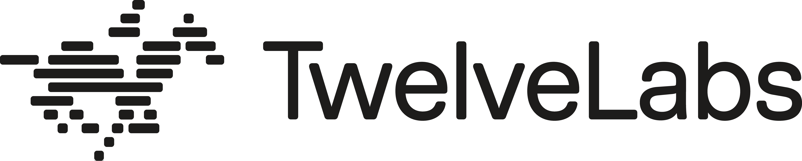

# AI-Powered Lecture Analysis Platform

<div align="center">
  
  <h2>Education Platform Built for TwelveLabs by Nathan Che</h2>
</div>

---

## 🚀 Quick Start

This platform provides AI-powered lecture analysis for both instructors and students. Follow the steps below to get started.

## 📋 Prerequisites

- Python 3.8+
- Node.js 18+
- AWS CLI
- TwelveLabs API Key

## ⚙️ Setup Instructions

### 1. Environment Configuration

Create the necessary environment files:

**Backend (API)**
```bash
# Navigate to the API directory
cd api

# Create .env file
touch .env
```

Add your environment variables to `api/.env`:
```env
# TwelveLabs Credentials
TWELVE_LABS_API_KEY
TWELVE_LABS_INDEX_ID

# AWS Credentials
AWS_ACCESS_KEY
AWS_SECRET_ACCESS_KEY
AWS_ACCOUNT_ID

# AWS Course Metadata Table
DYNAMODB_CONTENT_TABLE_NAME

# AWS User Metadata Table
DYNAMODB_CONTENT_USER_NAME

# AWS Video Storage Bucket
S3_BUCKET_NAME

# Google Gemini API Credentials
GOOGLE_API_KEY
```

**Frontend**
```bash
# Navigate to the frontend directory
cd frontend

# Create .env.local file
touch .env.local
```

Add your environment variables to `frontend/.env.local`:
```env

# TwelveLabs API Credentials
NEXT_PUBLIC_TWELVE_LABS_API_KEY
NEXT_PUBLIC_TWELVE_LABS_INDEX_ID

# AWS API Credentials 
AWS_ACCESS_KEY_ID
AWS_SECRET_ACCESS_KEY

# AWS Video Storage Bucket
AWS_S3_BUCKET_NAME
AWS_REGION

# Google Gemini API Credentials
GEMINI_API_KEY

# Base API Endpoint (If run on main.py)
NEXT_PUBLIC_API_URL=http://127.0.0.1:5000
```

### 2. AWS Configuration

Configure AWS CLI with your credentials:

```bash
aws configure
```

You'll be prompted to enter:
- AWS Access Key ID
- AWS Secret Access Key
- Default region name
- Default output format

### 3. Python Virtual Environment

Create and activate a Python virtual environment:

```bash
# Navigate to the project root
cd twelve-labs-education-poc

# Create virtual environment
python -m venv venv

# Activate virtual environment
# On Windows:
venv\Scripts\activate
# On macOS/Linux:
source venv/bin/activate
```

### 4. Install Python Dependencies

With your virtual environment activated:

```bash
# Navigate to the API directory
cd api

# Install requirements
pip install -r requirements.txt
```

### 5. Start the Backend Server

```bash
# Make sure you're in the API directory with venv activated
python main.py
```

The backend server will start on `http://localhost:8000`

### 6. Start the Frontend Development Server

Open a new terminal window:

```bash
# Navigate to the frontend directory
cd frontend

# Install dependencies (if not already installed)
npm install

# Start development server
npm run dev
```

The frontend will be available at `http://localhost:3000`

## 🎯 Usage

1. **Instructors**: Upload lecture videos, analyze content, and track student progress
2. **Students**: Access course materials, view lecture analysis, and track your learning progress

## 📁 Project Structure

```
twelve-labs-education-poc/
├── api/                    # Backend API (Python/FastAPI)
│   ├── helpers/           # Utility functions
│   ├── providers/         # Indiividual implementation for AI provider comparison (TwelveLabs, Google Gemini, AWS Nova)
│   └── main.py           # Main application entry point
├── frontend/              # Frontend (Next.js)
│   ├── src/
│   │   ├── app/          # Next.js app directory
│   │   ├── components/   # React components
│   │   └── context/      # React context providers
│   └── public/           # Static assets
└── README.md
```

## 📚 Documentation

### External Resources
- **[API Documentation](http://127.0.0.1:5000/redoc)** - Comprehensive API reference and endpoints
- **[Technical Report]** - Detailed technical analysis and implementation details

### Technical Architecture

<div align="center">
  
  <p><em>System Architecture Overview</em></p>
</div>

## 🔧 Troubleshooting

- **Port conflicts**: Ensure ports 3000 and 8000 are available
- **Environment variables**: Double-check that all required environment variables are set
- **AWS credentials**: Verify AWS CLI is properly configured
- **Python dependencies**: Make sure you're in the virtual environment when installing packages

## 📞 Support

For issues related to:
- **TwelveLabs API**: Check the [TwelveLabs Documentation](https://docs.twelvelabs.io/)
- **AWS Services**: Refer to [AWS Documentation](https://docs.aws.amazon.com/)
- **Project Issues**: Create an issue in the project repository

---

<div align="center">
  <p>Built with ❤️ using TwelveLabs</p>
</div>
